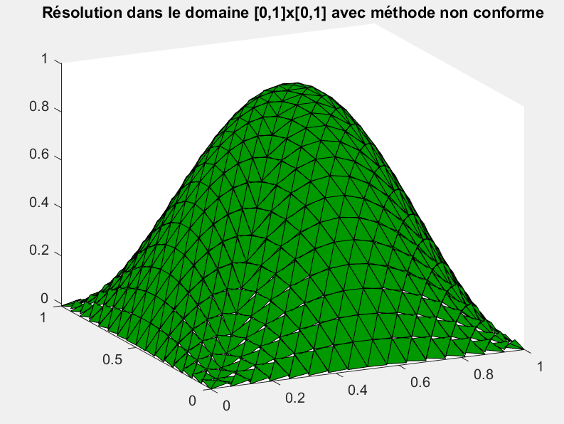
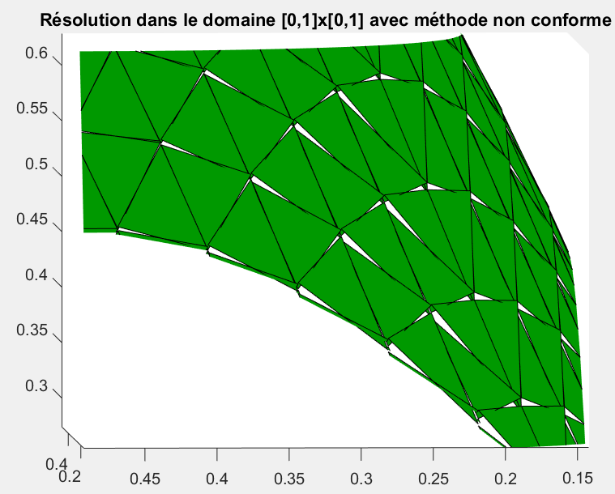

# Finite Element Method: Analysis and approximation of PDEs

This repository stores the code of an introductory course to a non-conformal Finite Elements Method, a similar but yet fundamentally different from the first repo 'Finite-Elements-Method' on the matter. 
Recall that the objective is to approach the unique solution of a well-posed problem via numerical methods. 
The originality of this project lies in the method of resolution employed, qualified of 'non-conformal'. 
Here, the term non-conformal signifies that the numerical solution does not lie in the same space than the PDEs' solution; in opposition to conformal methods also called Galerkin methods. It can be proved that the true solution lies in a Sobolev space, so that no discontinuity is allowed at the interface of the elements.

Let's give a quick illustration.

On the left figure below is the numerical solution calculated with this method to Laplace equation in a square domain. The right figure is a zoom on the finite elements of the left figure. One observe that the triangles are discontinuous throughout the interfaces, except at the middle point of the triangles' sides where they are in contact. This sole observation is sufficient to affirm that the numerical solution is non-conformal, as functions in a Sobolev space can not have such property.

 

For more details, please refer to the report.
